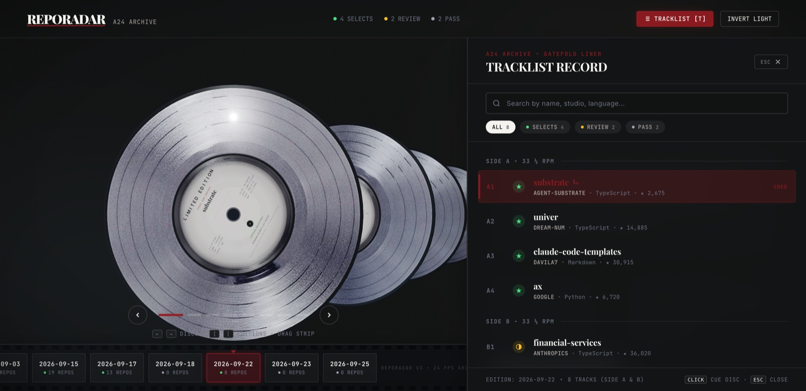
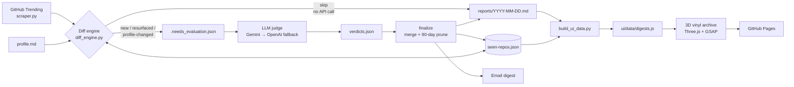

# RepoRadar

**Autonomous GitHub scouting with deterministic pre-filtering, LLM-as-judge, and an A24-inspired 3D WebGL vinyl record archive.**

[](https://github.com/buildwithAniket/RepoRadar/actions/workflows/ci.yml)


[](LICENSE)

**[🚀 Live Interactive 3D Experience](https://buildwithaniket.github.io/RepoRadar/)** &nbsp;·&nbsp; **[📑 Architecture Deep Dive](https://buildwithaniket.github.io/RepoRadar/architecture.html)**

[](https://buildwithaniket.github.io/RepoRadar/)

<sub>Edition 2026-09-22: 8 repositories judged, split into Side A (selects) and Side B (review / pass). The film strip at the bottom is the daily archive.</sub>

---

## The engineering problem

**Signal-to-noise.** GitHub Trending is a popularity feed, not a relevance feed. The same repositories trend for days, hype cycles crowd out useful tools, and nothing on the page knows what *you* care about.

**LLM cost.** Throwing an LLM at the whole feed every day fixes relevance but pays for it on every run: the same repositories are re-judged daily, context windows fill with unchanged metadata, and a failed API call either blocks the run or, worse, gets silently papered over.

RepoRadar's answer is to make the LLM the *last* resort: a deterministic engine decides **whether** a repository deserves judgment, and the model only decides **what** it thinks.

## Architecture: a two-stage filter plus a presentation layer

### Stage 1 — Deterministic diff engine (zero API calls)
Every trending repository is compared against a persistent state store (`seen-repos.json`). A repository is sent to the judge only if one of these rules fires ([`src/diff_engine.py`](src/diff_engine.py)):

| Rule | Trigger |
| :--- | :--- |
| `new` | Never seen before |
| `resurfaced` | Stars **≥ 2×** the count at last check, or a **new release tag** since last check |
| `profile-changed` | Previously judged `maybe` / `not-fit`, and `profile.md` has changed since |

Everything else is skipped without touching an API. Release metadata is fetched lazily, only for the candidates that survive the diff.

**Measured on the 9 production runs in [`reports/`](reports/):** 149 trending repositories scanned, **82 (55%) skipped deterministically**, 67 judged. **4 of 9 runs made zero LLM calls.** The skip rate rises as the state store matures, since each repository is judged once and then only re-judged on a real change.

### Stage 2 — LLM-as-judge
The surviving candidates are evaluated **in a single batched request** against the scouting taxonomy in [`profile.md`](profile.md) ([`src/judge.py`](src/judge.py)):

- Output contract: a JSON array of `{repo, verdict ∈ fit | maybe | not-fit, judgment}`, extracted from fenced or raw responses.
- Low temperature (0.2) for repeatable verdicts.
- Gemini (`gemini-2.5-flash`) primary, OpenAI fallback, 3 attempts with exponential backoff.
- **Fails loud:** with no API key, or after exhausting retries, it raises `RuntimeError` rather than fabricating verdicts.

### Stage 3 — Sync and presentation
`finalize` merges verdicts into state, prunes entries older than a **90-day sliding TTL** (configurable in [`config.yaml`](config.yaml)), renders `reports/YYYY-MM-DD.md`, emails the digest, rebuilds the UI bundle, and commits the result. The UI bundle ([`src/build_ui_data.py`](src/build_ui_data.py)) joins every markdown report with state metadata into `ui/data/digests.js`, which the static WebGL archive reads directly. No server, no API.

## System flow



## Key technical decisions

- **Deterministic first.** Scraping, diffing, and state are pure mechanics with no model in the loop, so they're unit-testable and rate-limit safe. The LLM only receives what the rules could not decide, and its output never silently replaces a failed call.
- **One batched judgment per run.** Cost scales with *change*, not with the size of the trending page. A quiet day costs nothing.
- **State hygiene.** A 90-day sliding TTL keeps `seen-repos.json` bounded, and a repository that ages out is treated as new if it trends again.
- **Static, hardware-accelerated UI.** Each digest is a pressed record rendered with Three.js: canvas-generated groove and label textures, `MeshPhysicalMaterial` discs, `THREE.Raycaster` picking, and `polygonOffset` on the label and groove layers to prevent coplanar Z-fighting. GSAP drives the transitions. The UI supports light and dark themes and respects `prefers-reduced-motion`. See [`ui/README.md`](ui/README.md).
- **Tests that don't rot.** The suite asserts invariants (every report is discovered, repo counts match the markdown source, the Node-loaded bundle mirrors the Python build) rather than today's data. Adding a report never breaks CI, and tests never write into the working tree.

## Quickstart

```bash
git clone https://github.com/buildwithAniket/RepoRadar.git && cd RepoRadar
python -m venv .venv && source .venv/bin/activate && pip install -e ".[dev]"
pytest                                   # 90 tests
```

**View the archive locally**

```bash
python src/build_ui_data.py              # regenerate ui/data/digests.js from reports/
python -m http.server 8000 --directory ui  # then open http://localhost:8000
```

**Run the pipeline**

```bash
cp .env.example .env                     # add GEMINI_API_KEY and/or OPENAI_API_KEY
python src/scan.py prepare               # scrape + diff → .needs_evaluation.json
python src/scan.py judge                 # LLM verdicts → verdicts.json
python src/scan.py finalize --dry-run    # report + state + UI bundle, no email/commit
```

## Automation

| Workflow | Trigger | What it does |
| :--- | :--- | :--- |
| [`ci.yml`](.github/workflows/ci.yml) | push / PR to `main` | Ruff + Black, pytest with coverage on Python 3.9–3.12, bundle build |
| [`deploy-pages.yml`](.github/workflows/deploy-pages.yml) | changes to `ui/`, `reports/`, state | Regenerates the bundle and deploys the archive to GitHub Pages |
| [`daily-radar.yml`](.github/workflows/daily-radar.yml) | cron `0 13 * * *` (opt-in) | `prepare → judge → finalize`, commits the new edition, redeploys Pages |

The daily workflow is inert until you set the repository variable `RADAR_ENABLED=true` and add the `GEMINI_API_KEY` / `OPENAI_API_KEY` secrets (plus `GMAIL_USER` / `GMAIL_APP_PASSWORD` for email).

## Repository layout

```
src/        pipeline: scraper, diff engine, state, judge, report, mailer, UI bundle builder
tests/      pytest suite (unit, adversarial, and finalize integration tests)
ui/         static WebGL archive (index.html, vendored Three.js + GSAP, generated data/)
reports/    one markdown digest per run
docs/       architecture diagram and product definition
```

## License

[MIT](LICENSE)
